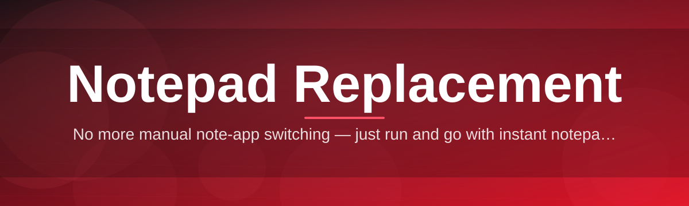
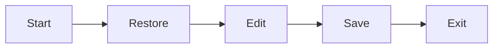

# notepad-editor-suite 📝⚡

  

*A quiet, fast, dependable text editor built to finally retire the notepad you outgrew years ago.*

  

## 🔍 Overview

notepad-editor-suite is a lightweight desktop text editor for Windows, purpose-built as a modern notepad replacement for people who write, log, configure, and think in plain text all day long. It keeps the instant-open, zero-friction spirit of the classic notepad while quietly correcting the things that always annoyed you about it — no tabs, no persistent sessions, no encoding surprises, no real syntax awareness. The result is a tool that opens in a blink, feels familiar within seconds, and then keeps giving you more the longer you use it.

This project exists because plain-text work never went away, even as editors got heavier. Developers dropping a quick `.env` note, sysadmins editing config files over a remote session, writers drafting without the distraction of a full IDE, students taking structured notes — all of them get funneled into either an underpowered default notepad or an oversized editor with a plugin ecosystem they never asked for. notepad-editor-suite sits deliberately in between: a single, self-contained binary that respects your CPU, your battery, and your attention span.

Who it's for: anyone who has ever right-clicked a file and chosen "Open with Notepad" out of habit, then wished it did just a little bit more — tabbed sessions, a dark theme that doesn't strain your eyes at 2 a.m., reliable auto-save, and search that actually finds what you typed. If that sounds like you, this suite was written with you specifically in mind.

> [!NOTE]
> This README documents behavior for the 2026 release line. Older builds may differ slightly in menu layout and default shortcuts.

---

## 🧩 What It Actually Does

- **Instant cold start** — the editor launches in a fraction of a second, matching (and usually beating) the boot time of the notepad it replaces, so it never becomes the reason you're waiting.

- **Tabbed multi-document editing** — work across several files in one window instead of juggling a dozen taskbar entries, with tabs that remember scroll position and cursor location.

- **Session persistence** — close the app mid-edit and reopen it later to find every unsaved tab exactly as you left it, including undo history where possible.

- **Encoding-aware file handling** — UTF-8, UTF-16, and legacy ANSI files are detected and displayed correctly instead of turning into a wall of garbled characters.

- **Lightweight syntax highlighting** — common formats (JSON, YAML, Markdown, INI, log files, shell scripts) get readable color cues without loading a full language server.

- **Smart find & replace** — regex support, whole-word matching, and in-selection replace, all reachable without leaving the keyboard.

- **Distraction-free mode** — hide every toolbar and status element down to a blank canvas and a blinking cursor, for when the writing itself is the only thing that matters.

- **Portable, standalone operation** — a single executable with no installer wizard, no background services, and no telemetry phoning home while you type.

> [!TIP]
> Pin the executable to your taskbar and set it as the default handler for `.txt`, `.log`, and `.md` files to fully retire the stock notepad shortcut.

---

## 🚀 Getting Started

1. **Visit the landing page** using the download button above or below — it is the only official distribution point for this project.

2. **Download the current build** for Windows 10 or 11; no separate runtime or framework install is required.

3. **Run the executable directly** — there is no setup wizard to click through, and no reboot is needed afterward.

4. **Open a file (or just start typing)** — the editor opens to a blank tab by default, ready for immediate input.

> [!IMPORTANT]
> Windows SmartScreen may flag the first run of any new, less-common executable. This is standard behavior for independently distributed Windows software, not a sign of a corrupted download.

---

## 💻 System Requirements

| Component | Minimum | Notes |
|---|---|---|
| OS | Windows 10 (64-bit) | Windows 11 fully supported |
| RAM | 128 MB free | Editor footprint stays small even with many tabs |
| Disk | 40 MB | Standalone, no dependency installs |
| Dependencies | None | No runtime, no framework, no background service |
| Internet | Not required | Fully offline after download |

---

## ⚙️ How It Works

The editor is intentionally simple under the hood, which is exactly what keeps it fast:

1. **Launch** — the process starts cold with no splash screen delay.

2. **Restore** — any previous session state (open tabs, cursor positions) is read from local storage.

3. **Edit** — keystrokes are applied to an in-memory text buffer with incremental rendering.

4. **Persist** — changes are written to disk on save, or silently checkpointed if auto-save is enabled.

5. **Exit** — the current session snapshot is stored so the next launch can resume where you left off.

> [!NOTE]
> Auto-save checkpoints are stored separately from the source file until you explicitly save, so an accidental edit never silently overwrites your original document.

---

## 🛟 Troubleshooting

<strong>The editor won't open a very large log file smoothly.</strong>

Files in the multi-hundred-megabyte range are loaded with a streaming reader; if scrolling feels sluggish, disable syntax highlighting for that tab from the status bar toggle — highlighting is the main cost on huge files.

<strong>My previous session didn't restore after a crash.</strong>

Session snapshots are written on a short interval, not on every keystroke. If the process was terminated abruptly, the most recent few seconds of unsaved edits may be lost, though the file on disk itself remains untouched.

<strong>Special characters look wrong in an older text file.</strong>

This usually means the file uses a legacy ANSI codepage. Use "Reopen with Encoding" from the File menu and select the matching codepage to redisplay it correctly.

<strong>Windows says the publisher is unverified.</strong>

This is expected for independently distributed software without an expensive code-signing certificate. Verify you downloaded from the official landing page linked in this README before proceeding.

<strong>Can I set this as my default text editor?</strong>

Yes — right-click any `.txt` file, choose "Open with," select the executable, and check "Always use this app."

---

## 🎨 UI, Themes & Shortcuts

The interface follows a single guiding principle: nothing should be between you and the text unless you asked for it. Two built-in themes — Daylight and Midnight — cover most preferences, and both respect Windows' system-wide light/dark setting by default.

> [!WARNING]
> Custom theme files loaded from untrusted sources can override color contrast in ways that make text hard to read. Only load theme files you trust.

| Shortcut | Action |
|---|---|
| `Ctrl + N` | New tab |
| `Ctrl + O` | Open file |
| `Ctrl + S` | Save |
| `Ctrl + Shift + S` | Save as |
| `Ctrl + W` | Close current tab |
| `Ctrl + Tab` | Next tab |
| `Ctrl + Shift + Tab` | Previous tab |
| `Ctrl + F` | Find |
| `Ctrl + H` | Find & replace |
| `Ctrl + G` | Go to line |
| `Ctrl + Z` / `Ctrl + Y` | Undo / redo |
| `Ctrl + Shift + K` | Delete current line |
| `Ctrl + D` | Duplicate current line |
| `F11` | Toggle distraction-free mode |
| `Ctrl + Plus` / `Ctrl + Minus` | Zoom text in / out |

> [!TIP]
> Every shortcut in the table above can be remapped from **Settings → Keyboard**, in case your muscle memory comes from a different editor.

---

## 🤝 Contributing & Community

Bug reports, feature discussions, and pull requests are all welcome through the repository's issue tracker. Before opening a large pull request, consider starting a discussion thread first — it keeps design decisions transparent and avoids duplicated effort on overlapping ideas.

> [!TIP]
> Small, focused pull requests (one feature or one fix) are reviewed and merged noticeably faster than large, multi-purpose ones.

Community badges:

  

---

## 📄 License

Released under the [MIT License](LICENSE), 2026. Use it, modify it, ship it inside your own tooling — just keep the license notice intact.

---

## ⚠️ Disclaimer

notepad-editor-suite is provided "as is," without warranty of any kind. While it is built for everyday reliability, users should maintain their own backups of important files, as with any text editing software. This project is an independent, community-driven notepad replacement and is not affiliated with or endorsed by Microsoft Corporation.

